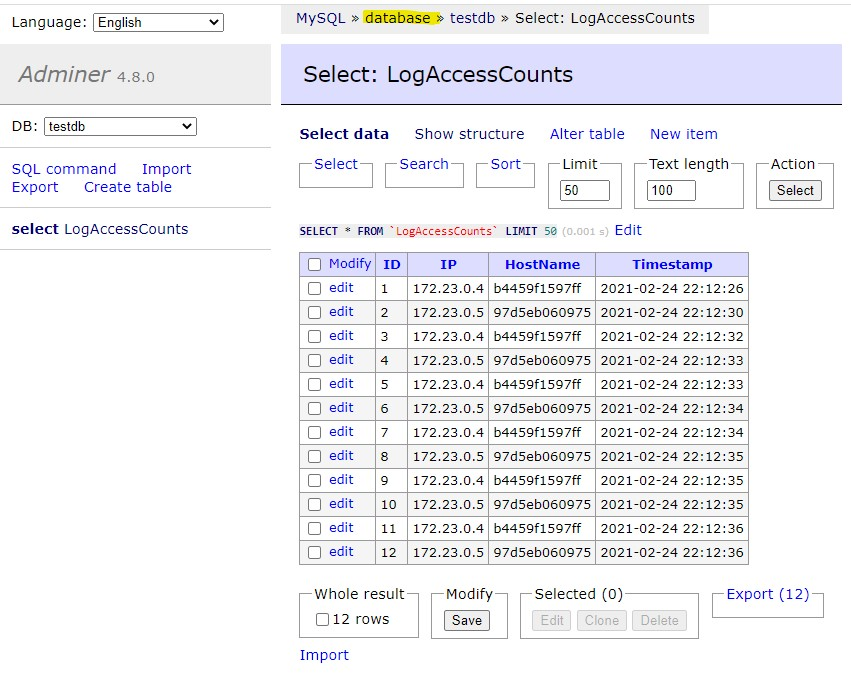
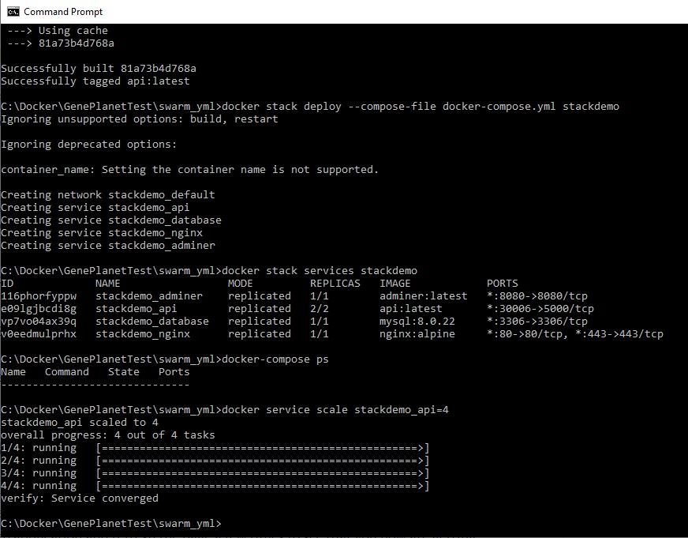

# An ASP.NET Core App example with Nginx and Docker, showcasing Load Balancing, static and dynamic worker scaling

## Intruduction

### Reading and evaluating ideas

Following the three articles, _[Configure ASP.NET Core to work with proxy servers and load balancers](https://docs.microsoft.com/en-us/aspnet/core/host-and-deploy/linux-nginx?view=aspnetcore-3.1#configure-nginx)_ and _[Host ASP.NET Core on Linux with Nginx](https://docs.microsoft.com/en-us/aspnet/core/host-and-deploy/linux-nginx?view=aspnetcore-3.1)_ and _[Medium Article](https://codeburst.io/load-balancing-an-asp-net-core-web-app-using-nginx-and-docker-66753eb08204)_, in Microsoft Docs, I created a demo application using Docker Compose, which orchestrates an Nginx reverse proxy server and an ASP.NET Core Web API app.

### Software Requirements

This demo works on all three platforms (windows/linux/macos)

You need to have installed **Docker** at least Community Edition ver. **20.10.2**

You need to have installed **.Net Core 3.1** or higher for your platform and set CLR commands (dotnet ...) accessible in Command Line/Terminal

Optionally you would need Visual Studio Code or similar Editor or IDE if you need to tweak code.

### Try demo out:

Download git repo and spin 3x workers:
```bash
docker-compose build
docker-compose up --scale api=3 --build
```
Almost set, go to **Database preparation** to set database and then you will be able to access all APIs described in **Web service exposure**

### Project creation
 Reading article _[Configure ASP.NET Core to work with proxy servers and load balancers](https://dev.to/avinashth/containerize-a-net-core-web-api-project-4p05)_, I created core application, based on default "Weather Forecast" web api service.
 
 Added MySQL Connector
 ```bash
  dotnet add package MySqlConnector
  ```

 Project compilation:
 ```bash
 dotnet publish -c Release
 ```
 Project loading & running:
  ```bash
 dotnet run
 ```

After testing, I ran project inside Docker containter (created Docker image and container):
```bash
docker build -t testimage -f Dockerfile .
docker run --name=testcontainer -p 8080:80 testimage
docker images
```

First initial Dockerfile for  project:
```bash
FROM mcr.microsoft.com/dotnet/aspnet:5.0

 COPY bin/Release/net5.0/publish/ MyWebAPI/
 WORKDIR /MyWebAPI
 ENTRYPOINT ["dotnet", "MyWebAPI.dll"]
```

Test example of web service access:
http://localhost:8080/weatherforecast

### Web service exposure

There are few web services that can be accessed:
  - Basic information, like service hostname, ip gateway and server ip address
  http://localhost
  - Default Weather forecast service with randomiozed data
  http://localhost/weatherforecast
  - Add +1 to counts table when called and store to sql db
  http://localhost/api/count/add
  - Show count score from sql db
  http://localhost/api/count/show

## Set database access
    
### Database preparation

For creating and testing table with data, I was running locally MySQL server. I recommend using _[HeidiSQL](https://www.heidisql.com/)_ or _MySQL Workbench_ for manual database tweeking. 

I was using docker image Adminer, which helped me with creating database, table and user. (you can access Adminer on http://localhost:8080) You can also access docker sql and use "mysql" command.

In the next steps we will: 
  - create database named "testdb", 
  - create database user, database and "LogAccessCounts" table (All scripts are in folder "sql-scripts")

**Adminer console**

Login to the server on address http://localhost:8080, **Server** is **database**, **Username** is root and **Password** is example1234 (described in docker-compose.yml).




Create myuser. Press "SQL Command" and copy then execute
```sql
CREATE USER 'myuser'@'localhost' IDENTIFIED BY 'mypass1234';
CREATE USER 'myuser'@'%' IDENTIFIED BY 'mypass1234';
GRANT ALL ON *.* TO 'myuser'@'localhost';
GRANT ALL ON *.* TO 'myuser'@'%';
flush privileges;
```

Create database testdb. Press "SQL Command" and copy then execute
```sql
CREATE DATABASE testdb;
USE testdb;
```

Lastly create LogAccessCount table. Press "SQL Command" and copy then execute
```sql
CREATE TABLE `LogAccessCounts` (
	`ID` INT(10) UNSIGNED NOT NULL AUTO_INCREMENT,
	`IP` VARCHAR(15) NULL DEFAULT '0',
	`HostName` VARCHAR(255) NULL DEFAULT '',
	`Timestamp` TIMESTAMP NULL DEFAULT CURRENT_TIMESTAMP,
	INDEX `ID` (`ID`)
)
COLLATE='utf8mb4_general_ci'
AUTO_INCREMENT=1;
```

You can alternatively connect to Docker MySQL server and use mysql tool.
Login to Docker MySQL Server:
```bash
docker exec -it <Name_of_root_folder>_database_1 /bin/bash
mysql -u root -p
mysql> ...  manually add or copy sql commands ...
```

### Optional step (can be skipped). Just in case if application wouldn't connect to MySQL, do additional check.
Important in /<Name_of_root_folder>/src/MyWebApi/ is file **"config.json"**, where we set access to db for worker. It is used as template to create workers.

Use value from **DBHOST** (docker-compose.yml) to access dockerizted mysql server, set username and password that have rw rights for "gene-task" database and table.
Recommended setting and are already in this repository: 
```bash
{
    "Data": {
        "ConnectionString": "server=database;user id=myuser;password=mypass1234;port=3306;database=testdb;"
    }
}
```

### Database exporting MySQLDump (optional step)

Login to MySQL Server:
```bash
docker exec -it <Name_of_root_folder>_database_1 /bin/bash
```

MySQL dump to file inside docker machine in /home folder:
```bash
cd home
mysqldump -u myuser -p testdb LogAccessCounts > LogAccess_dump.sql
```

Copy dump file to local folder named (for example) C:\Docker:
```bash
docker cp <Name_of_root_folder>_database_1:/home/LogAccess.sql c:\Docker\
```


## Set asp.net core app aplication

### Load Balancing - static
This is example of more simple mechanism, that can be implemented and run from docker-compose.yml file. You ghave to staticlly define beforehand, how many webworkers do we whant to scale.
Basicly it is Nginx web server acting as Loadbalancer as docker container and working application servers (asp.net core api) as worker nodes. MySQL DB is single, and has volume stored in host mysql server. (dockerized mysql server is using filesystem of host mysql server. Host mysql servrer needs to be shutdown or dockerized server set on different ports)

Demo is using http headers _X-Forwarded-For, X-Forwarded-Proto, X-Forwarded-Host_ to do load balancing task.

Finally the magic is done by first two commands. Third one is for adding additional worker. Parameter --scale api=4 is set for 4 worker nodes.
```bash
docker-compose build
docker-compose up --scale api=4 --build
```
### Load Balancing - dynamic
In this case, we will set Swarm mechanism in Docker, that will allow us dynamic scaling, during production.

Follow this steps:
```bash
$ docker swarm init
$ cd swarm_yml
$ docker-compose build
$ docker stack deploy --compose-file docker-compose.yml stackdemo
$ docker stack service stackdemo
ID             NAME                 MODE         REPLICAS   IMAGE            PORTS
116phorfyppw   stackdemo_adminer    replicated   1/1        adminer:latest   *:8080->8080/tcp
e09lgjbcdi8g   stackdemo_api        replicated   4/4        api:latest       *:30006->5000/tcp
vp7vo04ax39q   stackdemo_database   replicated   1/1        mysql:8.0.22     *:3306->3306/tcp
v0eedmulprhx   stackdemo_nginx      replicated   1/1        nginx:alpine     *:80->80/tcp, *:443->443/tcp
```

Or you can use:
```bash
docker service ls
```

Now, let's scale from default 2 web api workers to 4
```bash
$ docker service scale stackdemo_api=4
stackdemo_api scaled to 4
overall progress: 4 out of 4 tasks
1/4: running   [==================================================>]
2/4: running   [==================================================>]
3/4: running   [==================================================>]
4/4: running   [==================================================>]
verify: Service converged
```

If we want to destroy swarm service:
```bash
$ docker stack rm stackdemo
```

Or we can leave and initialize later (using docker swarm init cmd)
```bash
$ docker swarm leave --force
```



## Using Docker Swarm Load-Balancer

You can use Web Load-Balancer embeded in Docker Swarm. Rename file docker-compose.no-nginx.yml in (docker_yml folder) to docker-compose.yml. Also rename original docker-compose.yml to docker-compose.original.yml.

This new composer yml file will build database, adminer and api servers. Docker Swarm will do web traffic Load-Balancing.

It's slower than nginx, it doensn't change web api server on every request. Nginx ver. easly enables ssl (443) web connections.

Unfortunately you will have to dig more info, to enable ssl connections when using Docker Swarm Load-Balancing.

## Useful tools, when I was developing this demo

This demo works best on Linux (Ubnuntu, System76, RedHat) or MacOS and on Windows 10.

With this PowerShell (Win10) command, I have managed to get ip addresses of docker containers.
```bash
docker inspect -f '{{.Name}} - {{.NetworkSettings.IPAddress }}' $(docker ps -aq)
```

If you are using docker-compose the PowerShell command will be this:
```bash
docker inspect -f '{{.Name}} - {{range .NetworkSettings.Networks}}{{.IPAddress}}{{end}}' $(docker ps -aq)
```
On Linux _[this command](https://gist.github.com/ipedrazas/2c93f6e74737d1f8a791)_ would be usefull:
```bash
docker ps -q | xargs -n 1 docker inspect --format '{{ .Name }} {{range .NetworkSettings.Networks}} {{.IPAddress}}{{end}}' | sed 's#^/##';
```

Remotly connect to bash on docker container:
```bash
docker exec -it Docker-Container /bin/bash
```

Get logs from docker container
```bash
docker logs some-mysql
```

See all established connedtions on host or in docker 
```bash
netstat -aon | findstr :80
```
### Alternatives to this case fo Loadbalancing

This could be achived by using Kubernetes (on service provider like Linode, DO, Azure, aws) or _[Minikube](https://minikube.sigs.k8s.io/docs/start/)_. Kubernetes offers included loadbalancing among pods and scaling.

Or using _[KEDA](https://blog.tomkerkhove.be/2019/06/14/scaling-apps-with-keda/)_ on Azure.

## SSL

### Generate an OpenSSL certificate

On Windows, if you have _Git for Windows_ installed, then you can use the `openssl` command directly. Otherwise, the official page: _[OpenSSL.Wiki: Binaries](https://wiki.openssl.org/index.php/Binaries)_ contains useful URLs for downloading and installation guides.

```bash
openssl req -x509 -nodes -days 365 -newkey rsa:2048 -keyout localhost.key -out localhost.crt -passin pass:YourSecurePassword
```

This command will generate two files: `localhost.crt` and `localhost.key`.

Generated files are already included in this github repo for your convinience.
