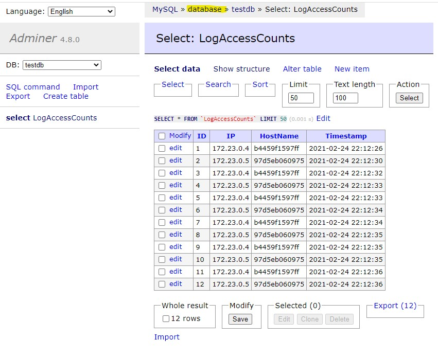

# GenePlanet Test - Host an ASP.NET Core App with Nginx and Docker: Load Balancing

## Reading and evaluating ideas

Following the three articles, _[Configure ASP.NET Core to work with proxy servers and load balancers](https://docs.microsoft.com/en-us/aspnet/core/host-and-deploy/linux-nginx?view=aspnetcore-3.1#configure-nginx)_ and _[Host ASP.NET Core on Linux with Nginx](https://docs.microsoft.com/en-us/aspnet/core/host-and-deploy/linux-nginx?view=aspnetcore-3.1)_ and _[Medium Article](https://codeburst.io/load-balancing-an-asp-net-core-web-app-using-nginx-and-docker-66753eb08204)_, in Microsoft Docs, I created a demo application using Docker Compose, which orchestrates an Nginx reverse proxy server and an ASP.NET Core Web API app.

## Project creation
 Reading article _[Configure ASP.NET Core to work with proxy servers and load balancers](https://dev.to/avinashth/containerize-a-net-core-web-api-project-4p05)_, I created core application, based on default "Weather Forecast" web api service.
 
 Added MySQL Connector
 ```bash
  dotnet add package MySqlConnector
  ```

 Project compilation:
 ```bash
 dotnet publish -c Release
 ```
 Project loading & running:
  ```bash
 dotnet run
 ```

After testing, I ran project inside Docker containter (created Docker image and container):
```bash
docker build -t testimage -f Dockerfile .
docker run --name=testcontainer -p 8080:80 testimage
docker images
```

First initial Dockerfile for  project:
```bash
FROM mcr.microsoft.com/dotnet/aspnet:5.0

 COPY bin/Release/net5.0/publish/ MyWebAPI/
 WORKDIR /MyWebAPI
 ENTRYPOINT ["dotnet", "MyWebAPI.dll"]
```

Test example of web service access:
http://localhost:8080/weatherforecast

## Web service exposure

There are few web services that can be accessed:
  - Basic information, like service hostname, ip gateway and server ip address
  http://localhost
  - Default Weather forecast service with randomiozed data
  http://localhost/weatherforecast
  - User name Helloworld display
  http://localhost/api/helloworld/{Enter your name}
  - Count +1 when called and store to sql db
  http://localhost/api/count
  - Show count score from sql db
  http://localhost/api/allcounts
    
## Database preparation

At creating and testing table with data, I was running MySQL server locally. I recommend _[HeidiSQL](https://www.heidisql.com/)_ or MySQL Workbench. 

First we need to add database, table and user on host db server.

I was using docker image Adminer, which helped me with creating database, table and user. (you can access Adminer on http://localhost:8080)

Now we will create database named "testdb", "LogAccessCounts" table, where web api services /api/count and /api/allcounts will insert or select data. And lastly we will create myuser, that can read/write data to table. (All scripts are in folder "sql-scripts")

Adminer console

Login to the server on address http://localhost:8080

Login into Adminer, use root and example1234 (described in docker-compose.yml).

Create myuser. Press "SQL Command" and copy then execute
```bash
CREATE USER 'myuser'@'localhost' IDENTIFIED BY 'mypass1234';
CREATE USER 'myuser'@'%' IDENTIFIED BY 'mypass1234';
GRANT ALL ON *.* TO 'myuser'@'localhost';
GRANT ALL ON *.* TO 'myuser'@'%';
flush privileges;
```

Create database testdb. Press "SQL Command" and copy then execute
```bash
CREATE DATABASE testdb;
USE testdb;
```

Lastly create LogAccessCount table. Press "SQL Command" and copy then execute
```bash
CREATE TABLE `LogAccessCounts` (
	`ID` INT(10) UNSIGNED NOT NULL AUTO_INCREMENT,
	`IP` VARCHAR(15) NULL DEFAULT '0',
	`HostName` VARCHAR(255) NULL DEFAULT '',
	`Timestamp` TIMESTAMP NULL DEFAULT CURRENT_TIMESTAMP,
	INDEX `ID` (`ID`)
)
COLLATE='utf8mb4_general_ci'
AUTO_INCREMENT=1;
```

Important in /GenePlanetTest/src/MyWebApi/ is file **"config.json"**, where we set access to db for worker. It is used as template to create workers.

Use value from **DBHOST** (docker-compose.yml) to access dockerizted mysql server, set username and password that have rw rights for "gene-task" database and table.
Recommended setting and are already in this repository: 
```bash
{
    "Data": {
        "ConnectionString": "server=database;user id=myuser;password=mypass1234;port=3306;database=testdb;"
    }
}
```

## Set database access in asp.net core app

## Load Balancing
This is example of more simple mechanism, that can be implemented in docker-compose.yml file. 
Basicly it is Nginx web server acting as Loadbalancer as docker container and working application servers (asp.net core api) as worker nodes. MySQL DB is single, and has volume stored in host mysql server. (dockerized mysql server is using filesystem of host mysql server. Host mysql servrer needs to be shutdown or dockerized server set on different ports)

Demo is using http headers _X-Forwarded-For, X-Forwarded-Proto, X-Forwarded-Host_ to do load balancing task.

Finally the magic is done by first two commands. Third one is for adding additional worker. Parameter --scale api=4 is set for 4 worker nodes.
```bash
docker-compose build
docker-compose up --scale api=4 --build

docker-compose up
```

## Useful tools, when I was developing this demo

This demo works best on Linux, like Ubnuntu, System76 or RedHat or MacOS. I didn't manage it to run on Windows 10. On Windows is problem of docker mysql server volume file mounting.

With this command, I have managed to get ip addresses of docker containers.
```bash
docker inspect -f '{{.Name}} - {{.NetworkSettings.IPAddress }}' $(docker ps -aq)
```

If you are using docker-compose the command will be this:
```bash
docker inspect -f '{{.Name}} - {{range .NetworkSettings.Networks}}{{.IPAddress}}{{end}}' $(docker ps -aq)
```

Remotly connect to bash on docker container:
```bash
docker exec -it Docker-Container /bin/bash
```

Get logs from docker container
```bash
docker logs some-mysql
```

See all established connedtions on host or in docker 
```bash
netstat -aon | findstr :80
```
## Alternatives to this case fo Loadbalancing

This could be achived by using Kubernetes (on service provider like Linode, DO, Azure, aws) or _[Minikube](https://minikube.sigs.k8s.io/docs/start/)_. Kubernetes offers included loadbalancing among pods and scaling.

Or using _[KEDA](https://blog.tomkerkhove.be/2019/06/14/scaling-apps-with-keda/)_ on Azure.

## SSL

### Generate an OpenSSL certificate

On Windows, if you have _Git for Windows_ installed, then you can use the `openssl` command directly. Otherwise, the official page: _[OpenSSL.Wiki: Binaries](https://wiki.openssl.org/index.php/Binaries)_ contains useful URLs for downloading and installation guides.

```bash
openssl req -x509 -nodes -days 365 -newkey rsa:2048 -keyout localhost.key -out localhost.crt -passin pass:YourSecurePassword
```

This command will generate two files: `localhost.crt` and `localhost.key`.

Generated files are already included in this github repo for your convinience.
